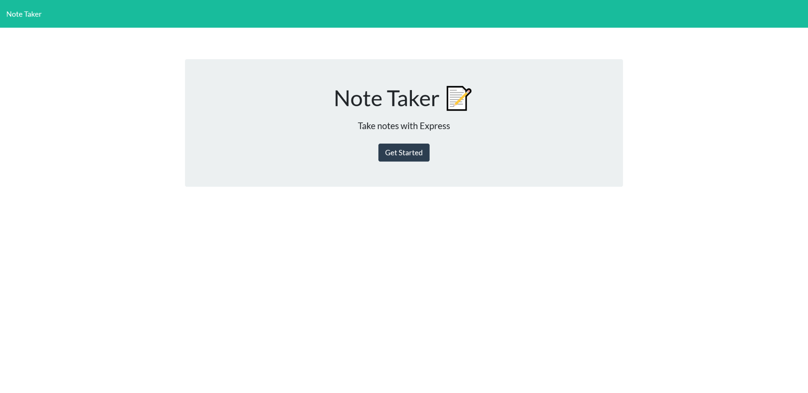

# Carl's Cool Note App

## Description

A simple note taking app to save your thoughs and reach them from any device.

Enter your note title and text, then hit the save icon in the top right corner. Click the trash icon next to the note to delete it.

## Table of Contents

- [Installation](#installation)

- [Usage](#usage)

- [Credits](#credits)

- [License](#license)

- [Contributing](#contributing)

- [Tests](#tests)

- [Questions](#questions)

## Installation

n/a

## Usage

As a forgetful person, I need to put my thoughts down somewhere, or I will get nothing done.

## Credits

Created by CarlJMcGee

## License

[This project uses MIT License](./mit.txt)

## Contributing

[Click to see the Contributor Covenant guidelines](./code_of_conduct.md)

## Tests

Type any note you like!

## Questions?

If you have any issues, submit them to my [Github](https://github.com/CarlJMcGee)

or

If you have any other questions or inquiries, you can contact me at [ltmcgeemaniii@gmail.com](mailto:ltmcgeemaniii@gmail.com)

## [Check it out!](https://carls-cool-note-app.herokuapp.com/)

